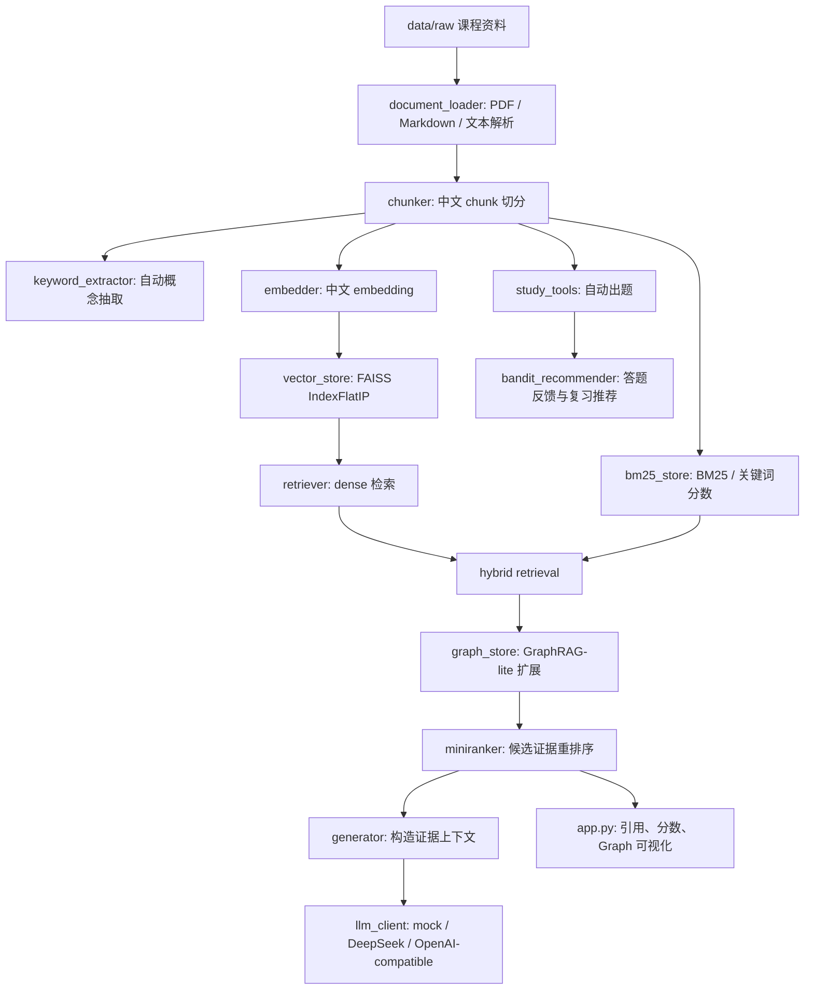

# CourseMind 技术文档

本文档面向项目开发、课程汇报和后续维护，说明 CourseMind 的系统目标、核心架构、数据流、关键算法、接口契约、运行模式和可扩展方向。

## 1. 项目定位

CourseMind 是一个面向中文深度学习课程资料的智能学习助手。系统将 PDF、Markdown、文本等资料转化为结构化 chunk，构建 FAISS 向量索引，并通过检索增强生成、GraphRAG-lite、MiniRanker 重排序、自动出题和 Bandit 复习推荐提供完整学习闭环。

项目当前重点不是做通用聊天机器人，而是做“基于本地课程资料的可解释学习系统”：

- 回答必须基于本地课程资料证据。
- 检索结果需要展示来源、页码、分数和扩展原因。
- GraphRAG 不只输出答案，还展示知识片段之间的关系。
- 出题和复习推荐要能反向利用用户答题反馈。

## 2. 核心能力边界

### 已实现

- PDF / 文本 / Markdown 资料解析。
- 中文 chunk 切分、章节识别和自动概念抽取。
- FAISS 本地向量库持久化。
- mock、lite、sentence-transformers、fastembed 多种 embedding provider。
- dense retrieval + BM25 混合检索。
- GraphRAG-lite 图扩展与可解释关系输出。
- React Force Graph 风格的前端图可视化。
- MiniRanker 候选证据重排序，支持 heuristic fallback 和 PyTorch 模型。
- DeepSeek / OpenAI-compatible LLM API 调用。
- 基于 chunk concept 的选择题生成。
- Bandit/UCB 复习推荐和答题反馈持久化。
- pytest 自动测试。

### 尚不应夸大的部分

- 当前自动出题不是完整 LLM 命题系统，而是基于 chunk 概念的规则化选择题生成。
- GraphRAG-lite 没有使用 Neo4j 等外部图数据库，而是在内存中基于文档结构和概念关系构图。
- lite embedding 是词法和 n-gram 向量，不等同于 transformer 语义模型。
- PDF 图片文字不再由系统自动识别，扫描版资料需要先转成可复制文本。

## 3. 总体架构



## 4. 目录结构

```text
CourseMind/
  app.py                         Streamlit 主页面
  src/
    schemas.py                   全局数据结构
    config.py                    .env 与运行模式
    document_loader.py           PDF / 文本解析
    chunker.py                   chunk 切分和章节识别
    keyword_extractor.py         自动关键词 / 概念抽取
    embedder.py                  embedding provider
    vector_store.py              FAISS 索引构建、保存、加载、搜索
    bm25_store.py                中文 token 和关键词分数
    retriever.py                 dense + BM25 混合检索
    graph_store.py               GraphRAG-lite 扩展与解释
    miniranker.py                候选证据重排序
    generator.py                 问答、总结、引用上下文
    llm_client.py                mock / DeepSeek / OpenAI-compatible 调用
    study_tools.py               自动出题
    bandit_recommender.py        Bandit 复习推荐
    answer_guard.py              拒答与证据保护
    ui_formatters.py             页面表格展示格式
  scripts/
    ingest.py                    构建 chunks 和 FAISS 索引
    build_training_pairs.py      构建 embedding 训练样本
    train_embedding.py           微调 sentence-transformers embedding
    train_miniranker.py          训练 MiniRanker
  data/
    raw/                         原始课程资料
    processed/                   本地生成 chunks 和状态文件
    indexes/                     本地 FAISS 索引
    eval/                        检索评测数据
    training/                    训练样本和模型 manifest
  models/
    embedding/                   本地 embedding 模型目录
  docs/                          项目文档
  tests/                         自动测试
```

## 5. 数据模型

核心数据结构定义在 `src/schemas.py`。

### DocumentPage

解析后的页级文本。

```python
DocumentPage(
    file_name: str,
    page: int,
    text: str,
)
```

### Chunk

检索、GraphRAG、出题和训练共用的最小知识片段。

```python
Chunk(
    chunk_id: str,
    file_name: str,
    page: int,
    text: str,
    chapter: str | None,
    concepts: list[str],
)
```

`chunk_id` 是全系统主键，命名格式近似：

```text
<safe_file_name>_p<page>_c<chunk_index>
```

### RetrievedChunk

检索阶段候选结果。

```python
RetrievedChunk(
    chunk: Chunk,
    dense_score: float,
    bm25_score: float,
    graph_score: float,
)
```

### RankedChunk

MiniRanker 排序后的最终证据。

```python
RankedChunk(
    chunk: Chunk,
    dense_score: float,
    bm25_score: float,
    graph_score: float,
    ranker_score: float,
)
```

### QuizItem

自动出题和 Bandit 反馈共用结构。

```python
QuizItem(
    question: str,
    options: list[str],
    answer: str,
    explanation: str,
    concept: str,
    source_chunk_id: str,
)
```

## 6. 数据导入与索引构建

入口脚本：

```bash
python scripts/ingest.py
```

默认流程：

```text
data/raw/*
-> collect_documents()
-> load_pdf()
-> chunk_pages()
-> persist_vector_store()
-> data/processed/chunks.jsonl
-> data/indexes/faiss.index
-> data/indexes/faiss.meta.json
```

支持文件类型：

```text
.pdf
.txt
.md
.markdown
```

`scripts/ingest.py` 会递归扫描 `data/raw/`，并把相对路径写入 `Chunk.file_name`。因此每个成员可以使用独立子目录，例如：

```text
data/raw/xujiaze/
data/raw/liushuyang/
data/raw/shiyan11-15/
```

## 7. 文档解析

模块：`src/document_loader.py`

虽然公共函数名仍叫 `load_pdf()`，但它实际支持 PDF、txt、Markdown。

### PDF 解析

PDF 使用 PyMuPDF 读取文本层：

```text
fitz.open(file)
-> page.get_text("text")
-> DocumentPage
```

如果 PDF 是扫描版或主要内容在图片中，当前系统不会自动识别图片文字。建议先用外部工具转成带文本层 PDF，或整理成 Markdown / txt 后再导入。

### 文本解析

文本文件按编码 fallback 读取：

```text
utf-8-sig -> utf-8 -> gb18030
```

如果文本中包含分页符 `\f`，会按分页符切成多个 `DocumentPage`。

## 8. PDF 图片限制

当前仓库已移除图片文字识别功能。解析器只读取 PDF 自带文本层，因此：

```text
可复制文字的 PDF     -> 可以解析
扫描版 / 图片型 PDF -> 无法直接识别图片文字
```

数据收集时建议优先提交 Markdown、txt 或带文本层 PDF。扫描版材料应先由成员手动整理，或使用外部工具转成可复制文本后再导入。

## 9. Chunk 切分与概念抽取

模块：

- `src/chunker.py`
- `src/keyword_extractor.py`

默认参数：

```text
chunk_size = 400
overlap = 80
```

切分流程：

```text
DocumentPage
-> split_page_into_sections()
-> split_text_into_chunks()
-> infer_concepts()
-> Chunk
```

章节识别支持中文标题模式，例如：

```text
一、项目目标
二、评分标准
1.1 模型训练
```

### 自动概念抽取

`infer_concepts()` 不再依赖人工维护的课程词表，而是调用 `extract_keywords()`：

```text
文本
-> jieba.analyse.extract_tags
-> jieba 分词顺序候选
-> 英文/数字术语候选
-> 过滤无效词和未在原文出现的候选
-> embedding 排序或统计排序
-> top_k concepts
```

在 `COURSEMIND_MODE=real/hybrid` 且使用 `sentence_transformers`、`fastembed` 等 provider 时，关键词排序使用 embedding 相似度，思路类似 KeyBERT：

```text
score(keyword) = cosine(embedding(chunk_text), embedding(keyword))
```

在 mock 或轻量测试场景下，系统使用统计 fallback，保证测试速度和稳定性。

## 10. Embedding 设计

模块：`src/embedder.py`

支持 provider：

```text
mock                 确定性 hash fallback
lite                 中文 token + char n-gram + concept 的轻量向量
sentence_transformers 本地或远程下载的 sentence-transformers 模型
fastembed            fastembed TextEmbedding
```

环境变量：

```text
COURSEMIND_MODE=real
EMBEDDING_PROVIDER=sentence_transformers
EMBEDDING_MODEL_PATH=models/embedding/finetuned
EMBEDDING_MODEL_NAME=BAAI/bge-small-zh-v1.5
EMBEDDING_DIM=384
```

### mock embedding

用于测试和 fallback。它不是语义模型，而是把 token 和 concept hash 到固定维度向量里，保证流程可重复。

### lite embedding

无 Torch 依赖，使用：

- 中文分词 token
- 字符 bigram / trigram
- 自动 concepts
- L2 normalization

它比纯 hash 更适合中文资料检索，但仍然偏词法匹配。

### sentence-transformers embedding

正式演示推荐使用。模型输出会 normalize，FAISS 使用内积检索，因此在归一化向量上等价于 cosine similarity。

## 11. FAISS 向量库

模块：`src/vector_store.py`

索引类型：

```python
faiss.IndexFlatIP(dim)
```

持久化文件：

```text
data/processed/chunks.jsonl
data/indexes/faiss.index
data/indexes/faiss.meta.json
```

`faiss.meta.json` 保存：

- index version
- backend
- metric
- dim
- chunk_ids
- raw source metadata
- embedding provider 信息

检索时先 embedding query，再调用：

```python
index.search(query_vector, top_k)
```

返回的 FAISS position 会通过 `chunk_ids` 映射回 `Chunk`。

## 12. BM25 / 关键词分数

模块：`src/bm25_store.py`

目前 BM25 模块承担的是轻量关键词补充分数角色。中文文本先用 jieba 分词，再计算 query token 与 chunk token 的重合强度，用于补充 dense retrieval 对精确术语、英文缩写、文件中短词的召回。

混合分数定义在 `src/retriever.py`：

```python
hybrid_score = 0.6 * dense_score + 0.4 * bm25_score
```

系统会先从 FAISS 中取候选，再计算每个候选的 BM25 分数，按 hybrid score 排序。

## 13. GraphRAG-lite

模块：`src/graph_store.py`

GraphRAG-lite 不依赖外部图数据库，而是把 chunk、页码、章节、相邻关系和概念关系看作轻量图结构。

### 节点类型

```text
file      文档节点
page      页节点
chunk     文本片段节点
concept   概念节点
```

### 边类型

```text
contains_page       file -> page
contains_chunk      page -> chunk
mentions_concept    chunk -> concept
adjacent            chunk -> chunk
```

问答检索阶段实际使用的扩展关系：

```text
seed              原始检索命中的 chunk
same_page         与 seed 在同一页
same_chapter      与 seed 在同一章节
adjacent          与 seed 在同一文件中相邻
shared_concept    与 seed 共享概念
```

### Graph 分数

当前关系分数：

```text
seed                 1.00
same_page            0.30
same_chapter         0.20
adjacent             0.25
shared_concept       0.40 + 0.10 * 共享概念数量
max_graph_score      1.00
```

对每个候选 chunk，系统会计算它与所有 seed chunk 的关系分数，并取最大值：

```text
graph_score(candidate) = max(score(candidate, seed_i))
```

最后截断到 `MAX_GRAPH_SCORE=1.0`。

### 共享概念过滤

为了避免 `深度学习`、`神经网络`、`网络` 这类过宽词污染图扩展，系统会按全库词频动态过滤：

```text
概念过短或为通用默认概念 -> 丢弃
短概念出现次数超过阈值 -> 丢弃
长概念出现次数超过阈值 -> 丢弃
```

这不是人工课程词表，而是根据当前 corpus 自动判断“这个词是否过于泛化”。

## 14. MiniRanker 重排序

模块：`src/miniranker.py`

MiniRanker 输入是 GraphRAG 扩展后的候选证据，输出 `RankedChunk`。

特征向量：

```text
dense_score
bm25_score
graph_score
same_page_bonus
same_chapter_bonus
chunk_length_norm
```

默认 heuristic 权重：

```text
0.42 dense
0.32 bm25
0.14 graph
0.05 same_page
0.04 same_chapter
0.03 chunk_length
```

real 模式下，如果存在：

```text
data/training/miniranker.pt
```

则加载 PyTorch 模型：

```text
Linear(6, 32) -> ReLU -> Dropout
-> Linear(32, 16) -> ReLU
-> Linear(16, 1) -> Sigmoid
```

最终分数还会与 dense、BM25、graph 做校准，并对过短 chunk 降权。

## 15. 回答生成

模块：

- `src/generator.py`
- `src/llm_client.py`
- `src/answer_guard.py`

问答流程：

```text
RankedChunk[]
-> build_evidence_context()
-> prompt
-> generate_text()
-> build_citations()
```

证据上下文包含：

- chunk_id
- file_name
- page
- ranker_score
- chunk text

DeepSeek 配置：

```text
COURSEMIND_MODE=real
LLM_PROVIDER=deepseek
DEEPSEEK_API_KEY=你的 key
LLM_MODEL=deepseek-v4-flash
LLM_API_BASE=https://api.deepseek.com/chat/completions
LLM_TIMEOUT=30
LLM_TEMPERATURE=0.2
LLM_MAX_TOKENS=1800
ANSWER_MAX_CHARS_PER_CHUNK=1200
```

`llm_client` 使用 OpenAI-compatible chat completions 协议，因此 DeepSeek 和 OpenAI-compatible provider 可以复用同一套调用逻辑。

## 16. 概念理解练习

模块：`src/study_tools.py`

当前实现不是让用户判断“某个证据片段对应哪个知识点”，而是围绕知识库概念生成两类选择题：

```text
chunk.concepts
-> 选择可教学概念
-> 概念解释题：从包含该概念的 chunk 中抽取解释性句子作为正确选项
-> 关键词遮罩题：把解释句中的 concept / keyword 替换为 ____
-> 从其他概念或关键词中构造干扰项
-> 稳定打乱选项，避免正确答案固定为 A
-> 输出 QuizItem
```

题干形式类似：

```text
关于“激活函数”，以下哪一项最符合知识库资料中的解释？
____ 会引入非线性，使神经网络能够学习复杂关系。
```

`generate_quiz()` 支持 `target_concept`，因此可以围绕 Bandit 推荐的薄弱知识点定向出题：

```python
generate_quiz(chunks, num_questions=3, target_concept="梯度下降")
```

这部分的价值在于把知识库中的概念理解、chunk 来源和答题反馈打通。后续可扩展为：

- 基于 LLM 的题干生成。
- 从 `questions.csv` 导入人工高质量题库。
- 按难度、章节、知识点覆盖率抽题。
- 支持填空题、判断题、简答题。

## 17. Bandit 复习推荐

模块：`src/bandit_recommender.py`

答题反馈入口：

```python
record_quiz_result(quiz_item, is_wrong=True | False)
```

状态文件：

```text
BANDIT_STATE_PATH=data/processed/quiz_state.json
```

每个 concept 记录：

```json
{
  "attempts": 0,
  "wrong": 0,
  "last_seen": null,
  "source_chunk_ids": []
}
```

推荐算法使用 UCB 思路：

```text
wrong_rate = wrong / attempts
explore = c * sqrt(log(total_attempts + 1) / attempts)
score = wrong_rate + explore
```

未练习过的知识点会获得较高探索分数；错题率高的知识点会获得较高利用分数。因此系统会在“补弱”和“覆盖新知识点”之间做平衡。页面会优先围绕推荐概念生成下一组练习题，形成“出题 -> 反馈 -> 推荐 -> 再出题”的闭环。

## 18. 前端页面

主文件：`app.py`

页面标签：

```text
问答
练习与复习
状态
```

问答页流程：

```text
用户问题
-> retrieve()
-> expand_with_graph()
-> rerank()
-> should_refuse()
-> answer_question()
-> citation_rows()
-> retrieval_rows()
-> graph_visualization_html()
```

Graph 可视化优先使用 React Force Graph 风格 HTML；失败时 fallback 到静态 HTML 图。

前端展示原则：

- 最终证据和检索明细分开，避免重复。
- GraphRAG 展示当前问题相关子图，而不是全量知识图。
- 红色或高亮节点表示最终证据。
- seed chunk、expanded chunk、concept、page 使用不同视觉编码。

## 19. 训练与评测

### Embedding 训练

构造训练对：

```bash
python scripts/build_training_pairs.py
```

数据来源：

```text
data/eval/retrieval_queries*.csv
data/raw/**/questions.csv
```

输出：

```text
data/training/embedding_pairs.jsonl
```

微调：

```bash
python scripts/train_embedding.py
```

训练方法：

```text
query
positive_text
negative_text
-> sentence-transformers TripletLoss
-> models/embedding/finetuned
```

### MiniRanker 训练

```bash
python scripts/train_miniranker.py
```

训练样本构造：

```text
retrieval query
-> retrieve top_k
-> GraphRAG expand
-> feature matrix
-> relevance label
-> PyTorch binary regression / ranking-like score
```

输出：

```text
data/training/miniranker.pt
data/training/miniranker_manifest.json
```

## 20. 测试策略

测试目录：`tests/`

覆盖范围：

- 文档解析：`test_document_loader.py`
- 中文切分：`test_chunker.py`
- 中文检索：`test_chinese_retrieval.py`
- FAISS：`test_embedding_vector_store.py`
- GraphRAG：`test_graph_store.py`
- MiniRanker：`test_miniranker.py`
- LLM 和答案保护：`test_llm_generator_guard.py`
- Bandit：`test_bandit.py`
- UI 展示格式：`test_ui_formatters.py`
- 自动关键词：`test_keyword_extractor.py`

运行：

```bash
python -m pytest
```

当前本地验证结果为：

```text
76 passed, 1 warning
```

## 21. 环境变量汇总

```text
COURSEMIND_MODE=mock | hybrid | real

EMBEDDING_PROVIDER=lite | sentence_transformers | fastembed
EMBEDDING_MODEL_NAME=BAAI/bge-small-zh-v1.5
EMBEDDING_MODEL_PATH=models/embedding/finetuned
EMBEDDING_DIM=384
KEYWORD_PROVIDER=embedding | statistical
KEYWORD_TOP_K=6

LLM_PROVIDER=mock | deepseek | openai | openai_compatible
DEEPSEEK_API_KEY=
LLM_API_KEY=
LLM_MODEL=deepseek-v4-flash
LLM_API_BASE=https://api.deepseek.com/chat/completions
LLM_TIMEOUT=30
LLM_TEMPERATURE=0.2
LLM_MAX_TOKENS=1800
ANSWER_MAX_CHARS_PER_CHUNK=1200

MINIRANKER_MODEL_PATH=data/training/miniranker.pt
BANDIT_STATE_PATH=data/processed/quiz_state.json
```

## 22. 典型运行命令

安装依赖：

```bash
pip install -r requirements.txt
```

构建索引：

```bash
python scripts/ingest.py
```

启动页面：

```bash
python -m streamlit run app.py --server.address 127.0.0.1 --server.port 8501
```

真实 embedding 模式：

```bash
set COURSEMIND_MODE=real
set EMBEDDING_PROVIDER=sentence_transformers
set EMBEDDING_MODEL_PATH=models/embedding/finetuned
python scripts/ingest.py
```

测试：

```bash
python -m pytest
```

## 23. 汇报讲解建议

技术汇报可以围绕“中文课程 RAG 系统如何引入深度学习能力”组织：

1. 数据层：把 PDF / Markdown 资料变成 chunk，保证知识可检索。
2. 表征层：使用中文 embedding 把文本映射到向量空间。
3. 检索层：FAISS 召回语义相似 chunk，BM25 补充关键词匹配。
4. 图层：GraphRAG-lite 沿页、章节、相邻和共享概念扩展证据。
5. 排序层：MiniRanker 学习或模拟“什么证据更适合回答”。
6. 生成层：DeepSeek 只基于证据生成答案，降低幻觉。
7. 学习闭环：自动出题记录反馈，Bandit 推荐薄弱知识点。

这条线比单纯说“调用了大模型 API”更有技术深度，因为它展示了数据处理、表征学习、检索、图扩展、排序和反馈推荐的完整链路。

## 24. 已知限制与改进方向

### 限制

- 自动出题仍较简单，题目表达质量依赖 chunk concepts。
- GraphRAG-lite 是内存图，数据量很大时需要分页、缓存或外部图存储。
- 扫描版 PDF 不再自动识别，需要先转成文本资料。
- MiniRanker 的训练质量依赖 `questions.csv` 和 eval 数据质量。
- 如果 raw 数据来源混乱，embedding 和 GraphRAG 都会受到影响。

### 改进方向

- 用 LLM 基于证据生成更自然的题目和解析。
- 使用人工 `questions.csv` 做自动出题评测。
- 增加 retrieval recall@k、MRR、nDCG 等检索评估。
- 对 GraphRAG 关系做离线缓存，减少页面计算压力。
- 引入更严格的答案引用格式和证据覆盖率检查。
- 把 Bandit 推荐与章节、难度、最近学习时间结合。
- 如果后续确实需要图片文字识别，可单独设计外部预处理脚本，不放入主检索链路。

## 25. 维护原则

- `src/schemas.py` 是数据契约，改动前必须同步测试和文档。
- 生成物默认不提交，尤其是 `data/processed/` 和 `data/indexes/`。
- 新增数据必须尽量补充 `metadata.csv` 和 `questions.csv`。
- real 模式能力要有 mock fallback，保证测试稳定。
- 页面演示功能必须能解释“分数从哪里来、证据从哪里来、关系为什么成立”。
